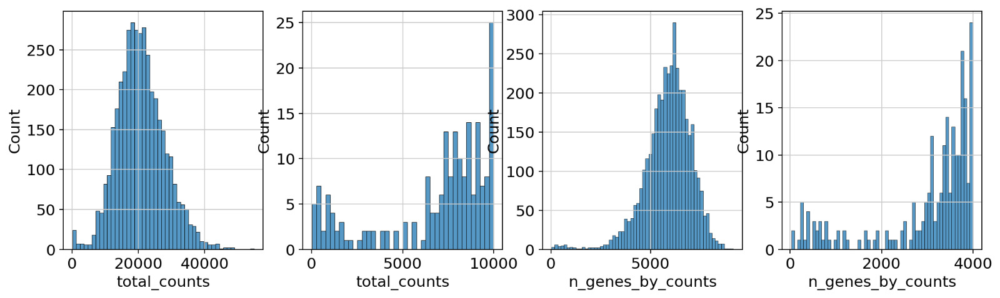
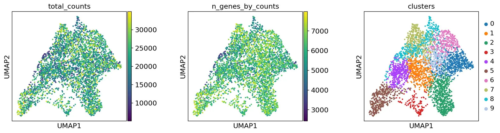
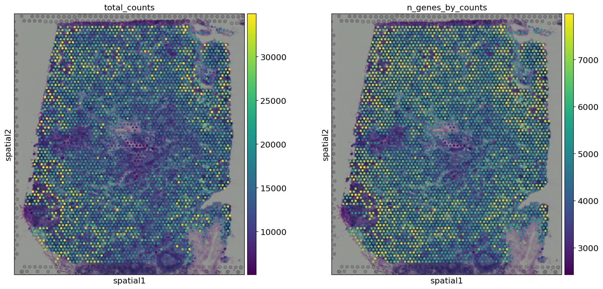
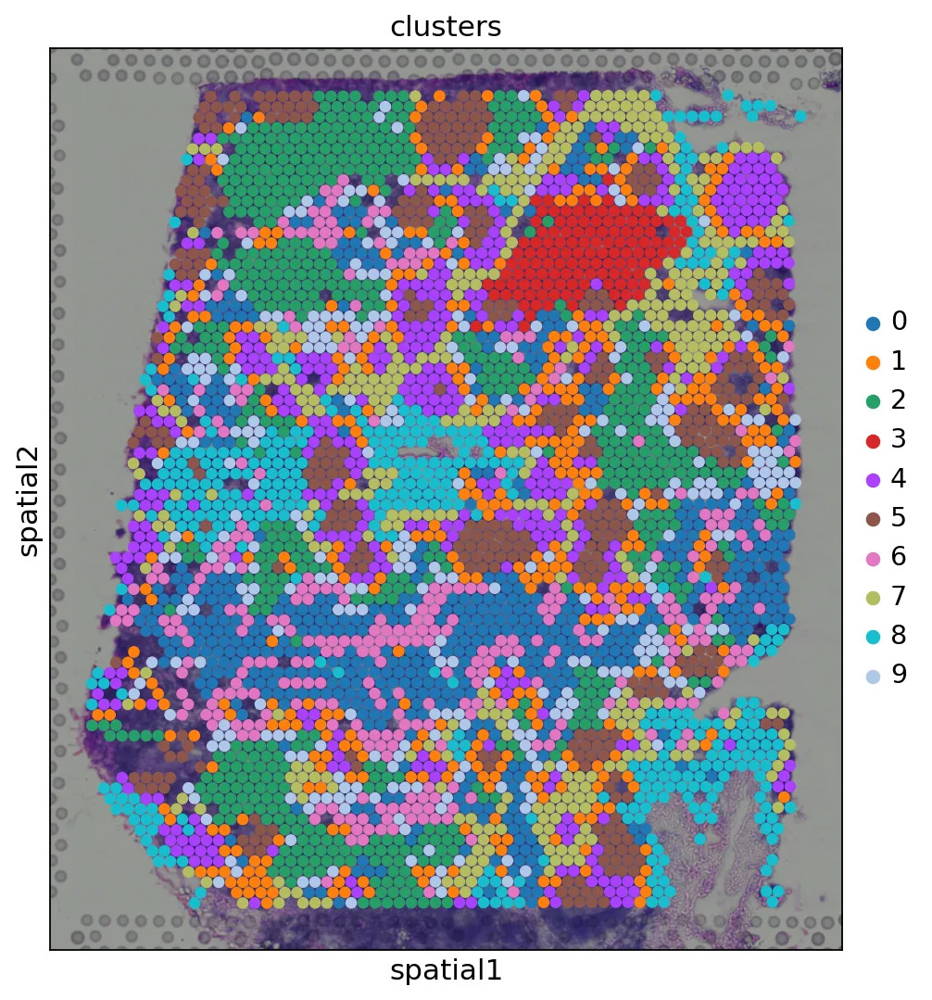
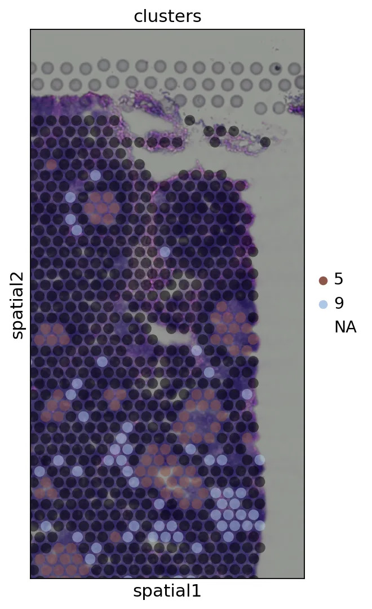
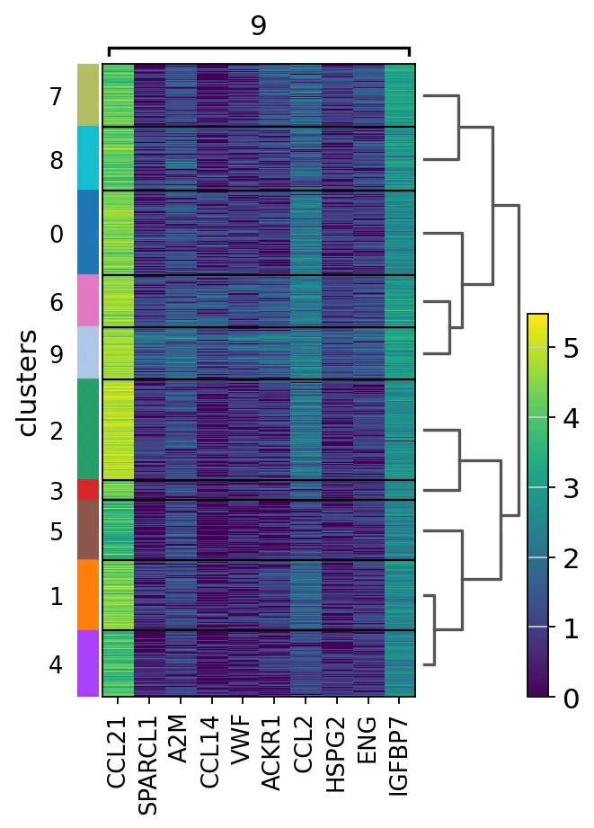
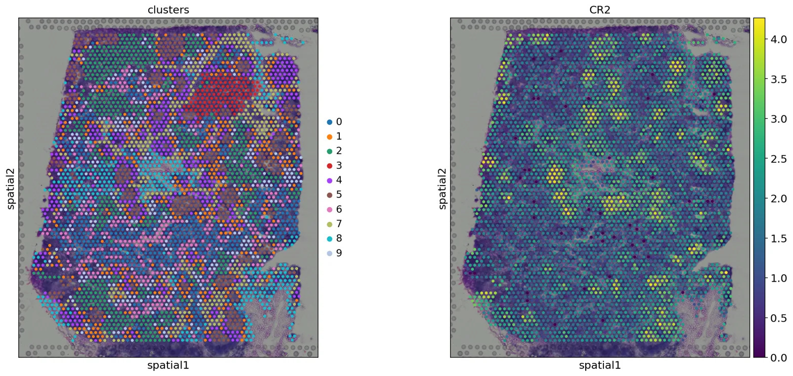
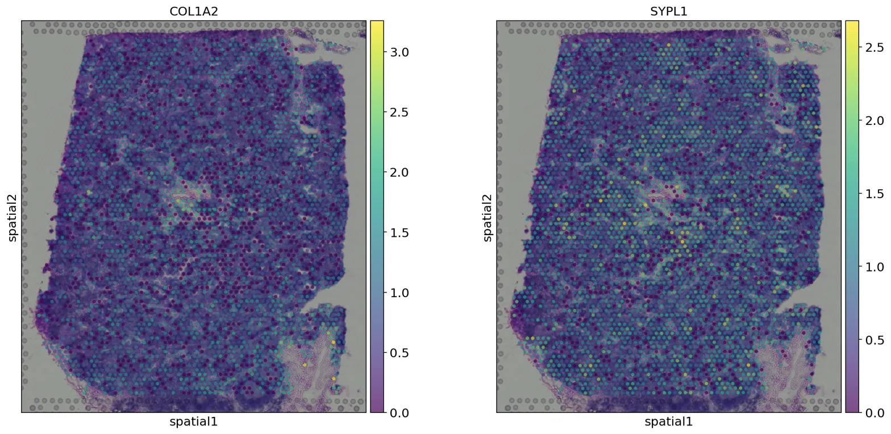

# Basic Spatial Analysis with Scanpy

Analysis of 10x Genomics Visium spatial transcriptomics data using Scanpy.

## Dataset

Human lymph node Visium section, downloaded automatically via `sc.datasets.visium_sge()`.

## Workflow

1. Load Visium data into AnnData
2. QC — filter by total counts, gene counts, and mitochondrial percentage
3. Normalize and select highly variable genes
4. PCA → neighbor graph → UMAP → Leiden clustering
5. Visualize clusters overlaid on H&E tissue image
6. Identify cluster marker genes

## Results

### QC Histograms

Distribution of total counts and genes per spot before and after filtering.

### UMAP

UMAP embedding colored by total counts, gene counts, and Leiden cluster.

### Spatial Counts

Total counts and number of detected genes overlaid on the H&E tissue image.

### Spatial Clusters

Leiden clusters overlaid on the H&E tissue image.

### Zoomed Clusters

Cropped view focusing on clusters 5 and 9 with reduced spot opacity.

### Marker Gene Heatmap

Top 10 marker genes for cluster 9 across all clusters.

### CR2 Spatial Expression

Spatial expression of CR2, the top marker gene for cluster 9.

### COL1A2 and SYPL1

Spatial expression of COL1A2 and SYPL1 across the tissue.

## Reference

[Scanpy spatial tutorial](https://scanpy-tutorials.readthedocs.io/en/latest/spatial/basic-analysis.html)
