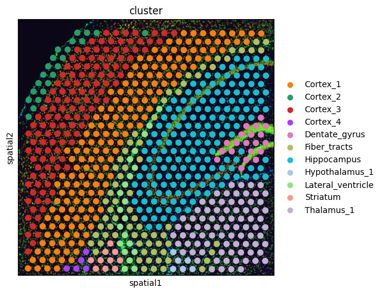
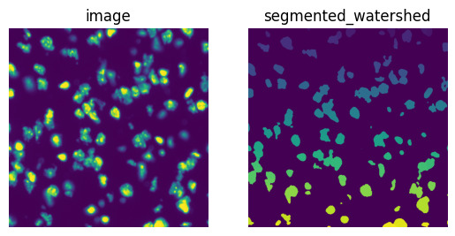
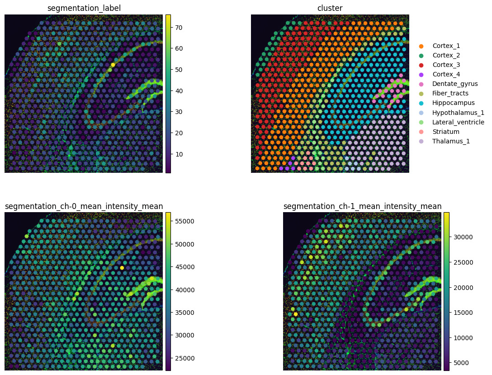

# Visium Fluorescence Image Analysis with Squidpy

Image-based spatial analysis of a 10x Genomics Visium fluorescence dataset
using Squidpy's image processing pipeline. The notebook is fully documented
with detailed explanations of each step, including the biological rationale
behind QC decisions, what each image processing operation does, and how to
interpret the outputs.

## Dataset

Pre-processed mouse brain coronal section (Visium) with a 3-channel
fluorescence image loaded via `sq.datasets.visium_fluo_adata_crop()`:

| Channel | Stain | Target |
|---------|-------|--------|
| 0 | DAPI | DNA / nuclei |
| 1 | anti-NEUN | Neurons |
| 2 | anti-GFAP | Glial cells |

The dataset is a cropped region of the full brain section to keep
computation fast while demonstrating the complete pipeline. Cluster
annotations were pre-computed using the standard Scanpy preprocessing
pipeline (normalization, PCA, Leiden clustering).

## Workflow

1. Load pre-processed AnnData and ImageContainer objects
2. Visualize pre-annotated clusters in spatial coordinates
3. Smooth fluorescence image using Gaussian filter to reduce noise
4. Segment nuclei from the DAPI channel using watershed algorithm
5. Calculate per-spot segmentation features — nucleus count, size, and
   mean fluorescence intensity per channel
6. Compare image-derived features against gene-expression cluster annotations
   to confirm both modalities capture the same tissue biology

## Notebook

The notebook (`visium_fluorescence.ipynb`) contains markdown explanations
before every code block describing what the step does, why it is done, and
what to look for in the output. It covers both the image processing concepts
(smoothing, watershed segmentation, feature extraction) and the biological
interpretation of the results.

## Results

### Spatial Clusters

Pre-annotated brain region clusters visualized in tissue space. This serves
as the gene-expression reference that image features will be compared against.

### Segmentation Comparison

Side-by-side comparison of the raw DAPI channel (left) and the watershed
segmentation mask (right) on a cropped region. Each color in the mask
corresponds to a uniquely labeled nucleus.

### Image Features vs Gene Clusters

Four-panel plot showing nucleus count per spot, cluster label, mean DAPI
intensity, and mean NEUN intensity. Agreement between image features and
gene-expression clusters confirms that both modalities are capturing the
same underlying tissue structure.

## Reference

[Squidpy Visium fluorescence tutorial](https://squidpy.readthedocs.io/en/stable/notebooks/tutorials/tutorial_visium_fluo.html)
