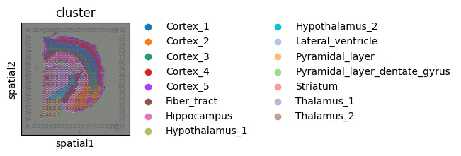
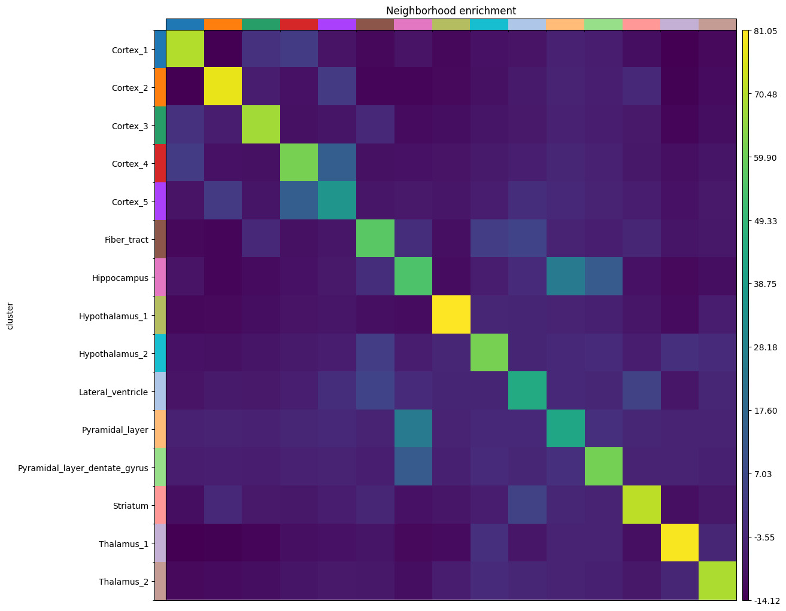
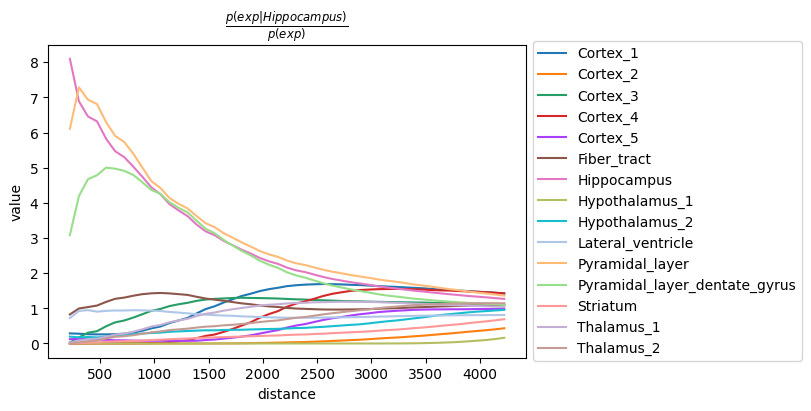

# Visium H&E Spatial Graph Analysis with Squidpy

Spatial graph statistics analysis of a 10x Genomics Visium H&E dataset
using Squidpy. The focus here is on the spatial relationships between
transcriptionally defined clusters — which clusters neighbor each other,
which co-occur at short distances, and which genes are likely being
communicated between adjacent clusters. The notebook is fully documented
with detailed explanations of every analysis step and how to interpret
each result.

## Dataset

Pre-processed mouse brain coronal section (Visium) with H&E staining,
loaded via `sq.datasets.visium_hne_adata()`. Cluster annotations cover
14 distinct brain regions including cortical layers, hippocampus,
hypothalamus, thalamus, striatum, and fiber tracts.

## Workflow

1. Load pre-processed AnnData and H&E ImageContainer
2. Visualize pre-annotated brain region clusters in spatial coordinates
3. Calculate image summary features per spot (mean intensity, std, percentiles)
4. Build spatial neighbor graph using hexagonal grid connectivity
5. Neighborhood enrichment — identify cluster pairs that are spatially
   enriched or depleted as neighbors, using a permutation-based test
6. Co-occurrence analysis — measure how co-occurrence probability between
   the Hippocampus cluster and all others changes across distance bins
7. Ligand-receptor interaction analysis — test which ligand-receptor pairs
   show significant expression between spatially adjacent cluster pairs

## Notebook

The notebook (`visium_hne.ipynb`) contains markdown explanations before
every code block covering the statistical methods used (permutation testing,
co-occurrence probability ratios, ligand-receptor scoring), what each
parameter controls, and how to read each output plot. Special attention
is given to explaining the difference between neighborhood enrichment
and co-occurrence, which measure related but distinct aspects of spatial
organization.

## Results

### Spatial Clusters

Pre-annotated brain region clusters overlaid on the H&E tissue image,
showing 14 distinct anatomical regions across the coronal section.

### Neighborhood Enrichment

Heatmap of enrichment scores for every cluster pair. Yellow cells indicate
pairs that are significantly enriched as spatial neighbors. The strong
diagonal confirms that each cluster is most enriched with itself, while
off-diagonal signals reveal biologically meaningful adjacencies such as
cortical layer transitions and hippocampal subregion boundaries.

### Co-occurrence — Hippocampus

Co-occurrence probability ratio as a function of distance, conditioned on
the Hippocampus cluster. Values above 1.0 at short distances indicate
clusters that tend to co-occur spatially with the Hippocampus. The
Pyramidal layer cluster shows the highest short-range co-occurrence,
consistent with its known anatomical position.

## Reference

[Squidpy Visium H&E tutorial](https://squidpy.readthedocs.io/en/stable/notebooks/tutorials/tutorial_visium_hne.html)
