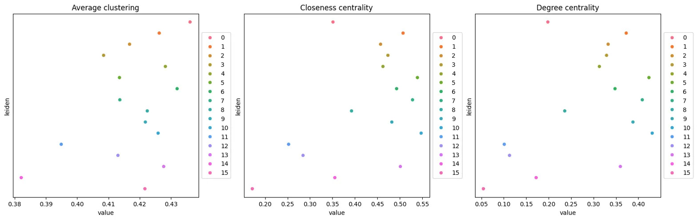
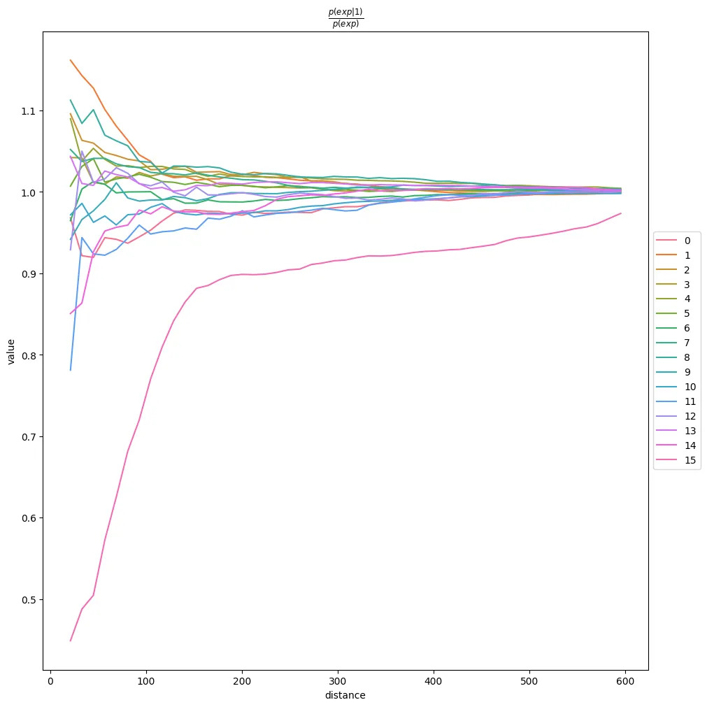
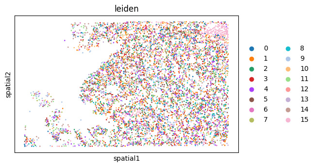

# Xenium Single-Cell Spatial Analysis with Squidpy

Single-cell resolution spatial transcriptomics analysis of 10x Genomics
Xenium data using Squidpy. Unlike Visium where each measurement spot covers
a 55-micron area containing multiple cells, Xenium assigns transcripts to
individually segmented cells, giving true single-cell spatial resolution.
The notebook is fully documented with detailed markdown explanations
covering how Xenium differs from Visium methodologically and why each
analysis choice is made.

## Dataset

FFPE Human Lung Cancer Xenium dataset (2 FOVs), downloaded directly from
10x Genomics:

```bash
curl -O https://cf.10xgenomics.com/samples/xenium/2.0.0/Xenium_V1_human_Lung_2fov/Xenium_V1_human_Lung_2fov_outs.zip
```

| Property | Value |
|----------|-------|
| Tissue | FFPE Human Lung Cancer |
| Panel | Xenium Human Multi-Tissue and Cancer Panel |
| Genes | 377 |
| XOA version | 2.0.0 |
| FOVs | 2 |
| Cells | 11,898 |

## Platform

All steps were run on Google Colab.

## Dependencies

```python
pip install scanpy squidpy igraph leidenalg scikit-image dask spatialdata spatialdata-io spatialdata-plot
```

## Workflow

### 1. Imports and Data Loading

```python
import spatialdata as sd
import spatialdata_plot
from spatialdata_io import xenium
import scanpy as sc
import squidpy as sq
import matplotlib.pyplot as plt

xenium_path = "./Xenium"

sdata = xenium(xenium_path, cells_as_circles=True)
adata = sdata["table"]
print(adata)
```

`spatialdata_io.xenium` reads the Xenium output directory and returns a
SpatialData object holding images, cell shapes, transcript coordinates,
and the cell-by-gene count table. We extract the count table as an AnnData
object. Cell spatial coordinates are automatically set in `adata.obsm["spatial"]`
by the reader.

### 2. Quality Control

```python
sc.pp.calculate_qc_metrics(adata, percent_top=(10, 20, 50, 150), inplace=True)

cprobes = adata.obs["control_probe_counts"].sum() / adata.obs["total_counts"].sum() * 100
cwords  = adata.obs["control_codeword_counts"].sum() / adata.obs["total_counts"].sum() * 100
print(f"Negative DNA probe %: {cprobes:.2f}")
print(f"Negative decoding %:  {cwords:.2f}")
```

Xenium has two types of built-in negative controls. Control probes are DNA
sequences with no biological target, so any signal from them is non-specific
background. Control codewords are invalid decoding patterns used to estimate
the rate of decoding errors. Both should be very low (under a few percent).
For this dataset the negative DNA probe percentage is 0.00% and the negative
decoding percentage is 0.01%, confirming high data quality.

### 3. Preprocessing and Clustering

```python
sc.pp.normalize_total(adata)
sc.pp.log1p(adata)
sc.pp.highly_variable_genes(adata)
sc.pp.pca(adata)
sc.pp.neighbors(adata)
sc.tl.umap(adata)
sc.tl.leiden(adata, flavor="igraph", directed=False, n_iterations=2)
```

Standard single-cell preprocessing pipeline applied at true single-cell
resolution. Normalization, log transformation, HVG selection, PCA, neighbor
graph construction, UMAP embedding, and Leiden clustering.

### 4. Spatial Neighbor Graph

```python
sq.gr.spatial_neighbors(adata, coord_type="generic", delaunay=True)
```

For Xenium data we cannot use the regular hexagonal grid approach from
Visium because cells are irregularly placed across the tissue. Instead
we use Delaunay triangulation, which connects each cell to its nearest
spatial neighbors in a way that respects the actual geometry of the tissue
without requiring a fixed grid structure.

### 5. Centrality Scores

```python
sq.gr.centrality_scores(adata, cluster_key="leiden")
sq.pl.centrality_scores(adata, cluster_key="leiden", figsize=(16, 5))
```

Centrality scores describe the spatial role of each cluster in the tissue.
Three scores are computed: degree centrality (how many spatial neighbors
a cluster has on average), closeness centrality (how close a cluster is
to all other clusters in the graph), and average clustering coefficient.

### 6. Co-occurrence Analysis

```python
adata_subsample = sc.pp.subsample(adata, fraction=0.5, copy=True)
sq.gr.co_occurrence(adata_subsample, cluster_key="leiden")
sq.pl.co_occurrence(adata_subsample, cluster_key="leiden", clusters="1", figsize=(10, 10))
```

We subsample to 50% of cells to keep computation manageable, then compute
co-occurrence scores across distance bins. This tells us how the spatial
relationship between cluster 1 and every other cluster changes with distance.

### 7. Spatial Autocorrelation

```python
sq.gr.spatial_autocorr(adata, mode="moran")
```

Moran's I measures whether a gene's expression is spatially clustered. A
score near +1 means cells with high expression tend to be near other cells
with high expression. A score near 0 means expression is randomly distributed
in space. This identifies genes whose expression is organized spatially.

### 8. Spatial Visualization

```python
adata_subsample = sc.pp.subsample(adata, fraction=0.5, copy=True)

sq.pl.spatial_scatter(
    adata_subsample,
    color=["leiden"],
    shape=None,
    size=2,
    img=False,
)
```

## Results

### Centrality Scores


Average clustering, closeness centrality, and degree centrality for each
Leiden cluster. Clusters with high closeness and degree centrality are
spatially central in the tissue, surrounded by many other cells across
multiple cluster types.

### Co-occurrence


Co-occurrence probability ratio as a function of distance, conditioned on
cluster 1. Values above 1.0 at short distances indicate spatial enrichment.
The drop toward 1.0 at longer distances confirms the effect is local
rather than global.

### Spatial Clusters


Leiden clusters visualized in single-cell spatial coordinates. Each dot
is one segmented cell. The two FOVs of the lung cancer section are visible,
with cluster boundaries reflecting both tumor and microenvironment structure.

## References

[Squidpy Xenium tutorial](https://squidpy.readthedocs.io/en/stable/notebooks/tutorials/tutorial_xenium.html)

Palla et al. (2022) Squidpy: a scalable framework for spatial omics analysis. *Nature Methods*. https://doi.org/10.1038/s41592-021-01358-2

10x Genomics Xenium Human Lung Cancer Dataset: https://www.10xgenomics.com/datasets/xenium-ffpe-human-lung-cancer
